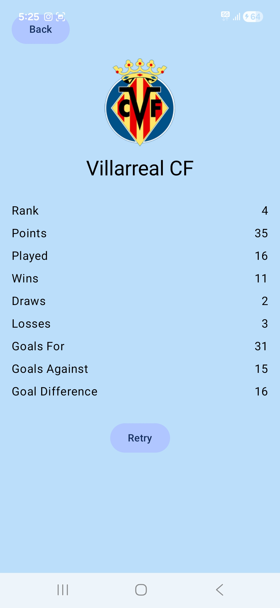
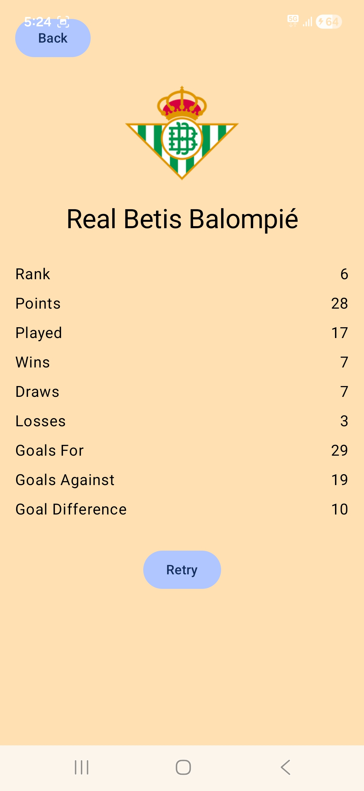

# ⚽ La Liga App (Android – Jetpack Compose)

An Android application that displays **live La Liga football standings** using a real football API.  
Built with **Jetpack Compose**, **MVVM**, **Retrofit**, and **Navigation Compose**.

---

## ✨ Features

- 📊 Live La Liga standings (real-time data)
- 🏆 Team ranking with points
- 🖼 Team logos displayed in UI
- 📄 Team detail screen with stats
- 🔄 Loading & Retry state
- 🎨 Rank-based UI colors
- ⬅️ Proper back navigation

---

## 📸 Screenshots

### Standings Screen


### Team Detail Screen


### Loading State


---

## 🚀 How to Run

1. Clone the repository  
   ```bash
   git clone https://github.com/<your-username>/LA_LIGA_2022.git
